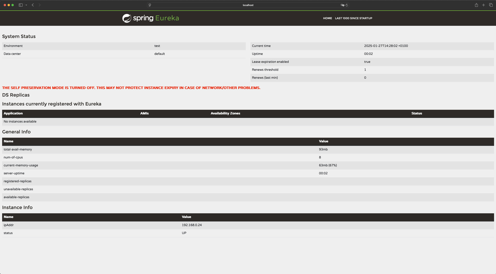
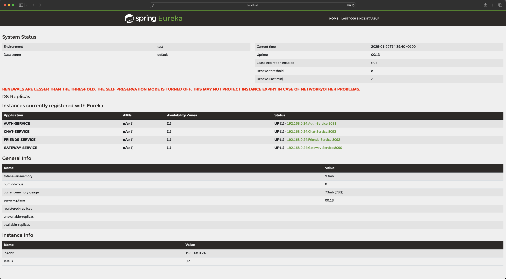

# Eureka Service Documentation

## Introduction
Eureka-Service that enables dynamic detection and register of microservices at runtime. It has been written
by using technologies:
* Java version 21.0.2
* Spring Boot version 3.4.0
* Spring Cloud version 2024.0.0-RC1
* Eureka Server: Spring Cloud Netflix Eureka
* Maven: for project dependency management and build automation

## Setup and configuration

* [application.properties](src/main/resources/application.properties)
* [maven config file](pom.xml)
 

## How it works?
To run project ensure that all dependencies are installed. Run the Eureka-Service by entering command:

```shell
mvn spring-boot:run
```

Once the Eureka-Service is running, you can access the dashboard by navigating to the following URL in your
browser:

http://localhost:8761


The result should look like this:



If any services are active and correctly configured in Gateway-Service, Eureka-Service will automatically 
discover them:



## Important annotations

For the Eureka-Service to work properly, make sure that the following annotations have been added to the main
application class:

* **@SpringBootApplication:** this is mandatory for Spring Boot,
* **@EnableEurekaServer:** this annotation activates the functionality of the Eureka server, enabling registration
and discovery of microservices
